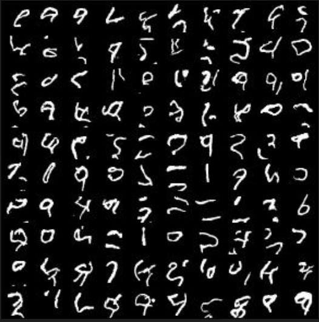

# Intro
- Implementation of [PixelCNN](https://arxiv.org/pdf/1606.05328.pdf)

# Run
```
python utils.py  # download MNIST
python train.py  # train model, set more details in config.py
python test.py # generate
```

# Sample
